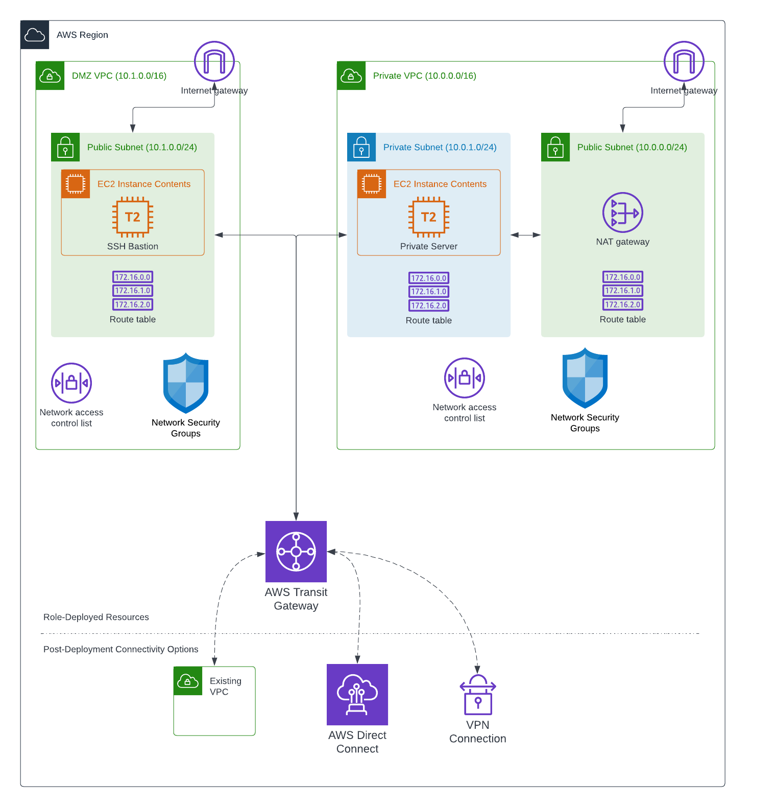

# Transit Network Deployment Role

This Ansible role contains repeatable automation for a hub-and-spoke VPC peering model that can help establish template infrastructure configurations that may be used for starting an AWS networking infrastructure strategy or to create demonstrations for network peering scenarios.

## Create Transit Network

This operation will create the resources necessary for a transit network model with two VPCs; one acting as a public internet-facing DMZ where bastion servers and other internet resources could exist, and another that acts as an entirely private network with no internet access.  These networks are configured with security groups and routing rules that allow traffic between the two VPCs and their subnets through the transit gateway.  Once deployed, you can SSH in to the bastion host in order to can access to the host on the private network.

### Variables

The following variables are used during deployment and can be configured as extra vars at deploy time if you require something other than the defaults.

#### Required

```yaml
---
aws_region: us-east-1 # The region in which the resources are deployed
priv_network_instance_ami: ami-06640050dc3f556bb # Replace with the proper RHEL AMI for your region.
dmz_instance_ami: ami-06640050dc3f556bb # Replace with the proper RHEL AMI for your region.
dmz_ssh_key_name: aws-test-key # The AWS SSH key to use when configuring access to the EC2 instances on the DMZ network.
priv_network_ssh_key_name: aws-test-key # The AWS SSH key to use when configuring access to the EC2 instances on the private network.
```

#### Optional

```yaml
---
# These variables can be configured to change the VPC networks and the EC2 instances deployed into them.
tenancy: default
vpc_priv_net_cidr: 10.0.0.0/16
vpc_priv_net_priv_subnet_cidr: 10.0.0.0/24
vpc_dmz_cidr: 10.1.0.0/16
vpc_dmz_subnet1_cidr: 10.1.0.0/24
dmz_instance_type: t2.micro
dmz_instance_name: dmz-ssh-tunnel-vm
priv_network_instance_type: t2.micro
priv_network_instance_name: priv-network-vm
```

### Infrastructure

The following AWS infrastructure resources are created during this deployment.  Each resource is configured with a set of tags that are used to determine if resources already exist, and which resources to clean up if the `delete` operation is run.

### Architecture Diagram



Resources below the dotted line demonstrate how you may connect other resources to the VPCs through a transit gateway attachment.